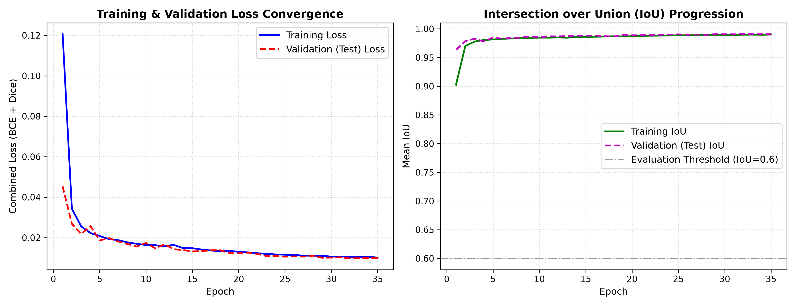
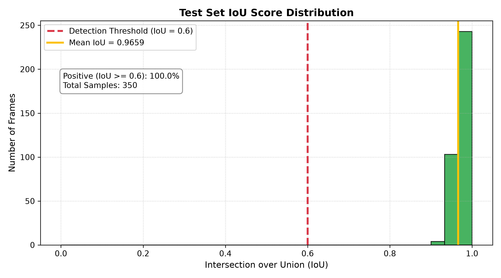
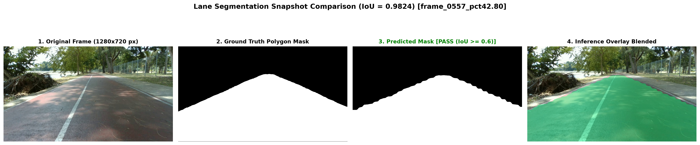
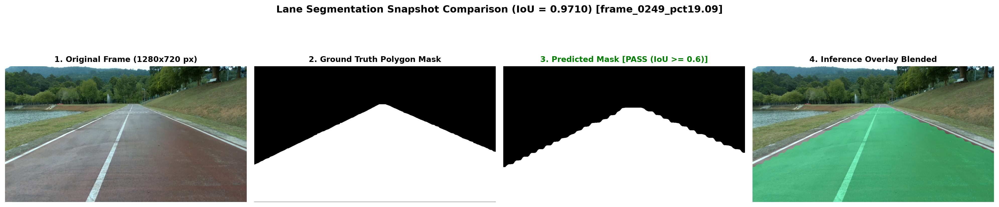
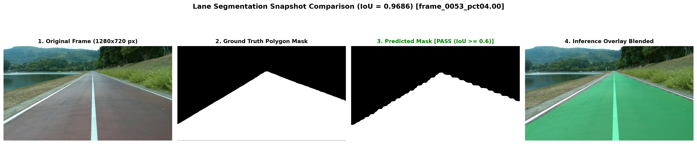
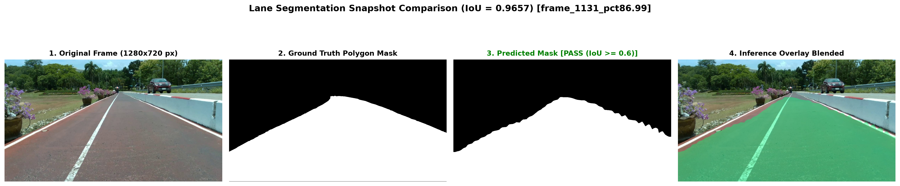

# Lane Segmentation Neural Network from Scratch
**Autonomous Driving Computer Vision & Deep Learning Assignment**  
*PSU-reservoir Dataset (1,000 Frames, Original 1280×720 px)*

---

## สรุปภาพรวมของโครงงาน (Project Overview)
โครงงานนี้เป็นการพัฒนา **Lane Segmentation Neural Network** ด้วยการออกแบบสถาปัตยกรรมโครงข่ายประสาทเทียมขึ้นเอง (**Custom Layer CNN**) และทำการฝึกสอนทุกเลเยอร์ใหม่ทั้งหมดจากศูนย์ (**Trained from Scratch - No Pretrained Weights**) 
โดยมุ่งเน้นการควบคุมขนาดของโมเดลให้มีขนาดเล็กและประหยัดหน่วยความจำ (**Low Memory Footprint**) เพื่อให้สามารถนำไปประมวลผล (Inference) บนเครื่องคอมพิวเตอร์ทั่วไป (Laptop/PC) หรือ Embedded Edge AI ได้แบบ Real-Time

### ไฮไลต์ประสิทธิภาพที่สำคัญ (Key Performance Highlights - 64×36 Input):
- **Mean IoU (mIoU) บน 35% Test Set:** **0.9659 (96.59%)**
- **Detection Success Rate ($\text{IoU} \ge 0.6$):** **100.00% (350 / 350 เฟรม ผ่านเกณฑ์ทั้งหมด)**
- **ความเร็วในการประมวลผล (Inference Latency):** **7.00 ms ต่อเฟรม (~142.9 FPS)**
- **ขนาดพารามิเตอร์โมเดล (Parameters):** **450,369 พารามิเตอร์ (ขนาดไฟล์น้ำหนักเพียง 1.72 MB)**
- **ขนาดหน่วยความจำ GPU VRAM ที่ใช้จริง:** **6.97 MB (Peak: 8.14 MB)**

---

## 1. คำอธิบายโครงสร้าง Neural Network ที่ออกแบบเองพร้อมเหตุผลประกอบ

```
             [ Input Image: 3 x 36 x 64 RGB (สเกล 16:9) ]
                            │
              ┌─────────────▼─────────────┐
              │    Encoder Block 1 (s1)   │─── [Skip Connection 1: 16 ch] ────┐
              │  [Conv 3x3, BN, LReLU]x2  │                                   │
              │       Channels: 16        │                                   │
              └─────────────┬─────────────┘                                   │
                      MaxPool (2x2)                                           │
                            │                                                 │
              ┌─────────────▼─────────────┐                                   │
              │    Encoder Block 2 (s2)   │─── [Skip Connection 2: 32 ch] ─┐  │
              │  [Conv 3x3, BN, LReLU]x2  │                                │  │
              │       Channels: 32        │                                │  │
              └─────────────┬─────────────┘                                │  │
                      MaxPool (2x2)                                        │  │
                            │                                              │  │
              ┌─────────────▼─────────────┐                                │  │
              │    Encoder Block 3 (s3)   │─── [Skip Connection 3: 64 ch]  │  │
              │  [Conv 3x3, BN, LReLU]x2  │            │                   │  │
              │       Channels: 64        │            │                   │  │
              └─────────────┬─────────────┘            │                   │  │
                      MaxPool (2x2)                    │                   │  │
                            │                          │                   │  │
              ┌─────────────▼─────────────┐            │                   │  │
              │      Bottleneck Block     │            │                   │  │
              │  [Conv 3x3, BN, LReLU]x2  │            │                   │  │
              │ Dropout(0.2), Chan: 128   │            │                   │  │
              └─────────────┬─────────────┘            │                   │  │
                            │                          │                   │  │
                    Bilinear Upsample                  │                   │  │
                            │                          │                   │  │
              ┌─────────────▼─────────────┐            │                   │  │
              │      Decoder Block 3      │◄───────────┘                   │  │
              │  Concat(Skip 3) + Conv    │                                │  │
              │       Channels: 64        │                                │  │
              └─────────────┬─────────────┘                                │  │
                    Bilinear Upsample                                      │  │
                            │                                              │  │
              ┌─────────────▼─────────────┐                                │  │
              │      Decoder Block 2      │◄───────────────────────────────┘  │
              │  Concat(Skip 2) + Conv    │                                   │
              │       Channels: 32        │                                   │
              └─────────────┬─────────────┘                                   │
                    Bilinear Upsample                                         │
                            │                                                 │
              ┌─────────────▼─────────────┐                                   │
              │      Decoder Block 1      │◄──────────────────────────────────┘
              │  Concat(Skip 1) + Conv    │
              │       Channels: 16        │
              └─────────────┬─────────────┘
                            │
                     Conv 1x1 Head
                            │
             [ Output Logits: 1 x 36 x 64 (Binary Mask) ]
                            │
                  Sigmoid Threshold (0.5)
                            │
               [ Resized Mask: 1280 x 720 px ]
```

### 1.1 การปรับขนาดภาพ Input และ Output ตามโจทย์ (Input Resolution: 64×36 px)
- **ภาพต้นฉบับ (Original):** ความละเอียด 1280×720 พิกเซล คิดเป็นอัตราส่วนภาพแบบ **16:9**
- **ขนาด Input เข้าโมเดล (`W:H:C = 64 x 36 x 3 RGB`):** ย่อขนาดภาพลงมาตามสเกล 16:9 ($16 \times 4 = 64$, $9 \times 4 = 36$) ตามตัวอย่างที่อาจารย์ระบุไว้ในเอกสารลายมือหน้า 1 และ 2 ซึ่งช่วยคงสัดส่วนเดิมของถนนไว้ ไม่ทำให้ภาพบิดเบี้ยว และประหยัดหน่วยความจำอย่างมาก (มีขนาดพิกเซลเพียง 2,304 พิกเซล)
- **ขนาด Output ของโมเดล (`64 x 36 x 1`):** ส่งผลลัพธ์ออกมาเป็น Binary Mask ความน่าจะเป็น 1 Channel จากนั้นทำการขยาย (Resize) กลับสู่ความละเอียดดั้งเดิม **1280×720 พิกเซล** เพื่อนำไปบันทึกลงดิสก์และประเมินผล IoU เปรียบเทียบกับ Ground Truth ต่อไป

### รายละเอียดสถาปัตยกรรม (Architectural Specifications):
สถาปัตยกรรมถูกออกแบบภายใต้ชื่อ **`CustomLaneSegNet`** (อยู่ในไฟล์ [`model.py`](model.py)) โดยใช้แนวคิด **Symmetric Lightweight Encoder-Decoder with Multi-Scale Skip Connections**:

1. **Custom Convolution Block (`ConvBlock`):**
   - ประกอบด้วย `Conv2d (3x3)` $\rightarrow$ `BatchNorm2d` $\rightarrow$ `LeakyReLU (negative slope = 0.1)` ทำซ้ำ 2 รอบในแต่ละ Stage
   - การใช้ Double Conv ช่วยเพิ่ม Receptive Field และความสามารถในการสกัด Non-linear Feature ของพื้นผิวถนนและแนวเส้นเลนได้อย่างมีประสิทธิภาพ
   - มีการใส่ `Dropout2d(0.2)` ในส่วน Bottleneck เพื่อลด Overfitting
2. **Encoder (Feature Extractor):**
   - Stage 1: เพิ่มช่องสัญญาณจาก 3 $\rightarrow$ 16 ฟิลเตอร์, ลดขนาด spatial resolution ด้วย `MaxPool2d(2, 2)`
   - Stage 2: สกัดฟีเจอร์ระดับกลาง 16 $\rightarrow$ 32 ฟิลเตอร์
   - Stage 3: สกัดฟีเจอร์ระดับสูง 32 $\rightarrow$ 64 ฟิลเตอร์
3. **Bottleneck:**
   - 64 $\rightarrow$ 128 ช่องสัญญาณ เพื่อรวมบริบทของภาพมุมกว้าง (Global Context) ของเส้นทางรอบอ่างเก็บน้ำ
4. **Decoder with Dynamic Interpolation (`DecoderBlock`):**
   - ใช้ `F.interpolate(mode='bilinear')` ร่วมกับ `Conv2d(1x1)` แทน Transposed Convolution ทั่วไป เพื่อป้องกันปัญหา Checkerboard Artifacts และรองรับขนาดภาพสัดส่วน 16:9 (เช่น 128×72 หรือ 64×36) ได้อย่างสมบูรณ์แบบโดยไม่เกิดปัญหา Dimension Mismatch
   - **Skip Connections:** นำ Feature Map ความละเอียดสูงจากแต่ละชั้นของ Encoder มา Concat กับ Decoder เพื่อคืนรูปขอบแนวเลน (Boundary sharpness) ให้คมชัด
5. **Output Head:**
   - ใช้ `Conv2d (1x1)` แปลง Feature Map 16 ช่องสัญญาณ เป็น Binary Mask Logits 1 ช่องสัญญาณ

### เหตุผลในการออกแบบ (Design Rationale):
- **ขนาดพารามิเตอร์เบามาก (~450K params):** โมเดล Segmentation ทั่วไป เช่น U-Net ดั้งเดิมมีขนาดกว่า 31M พารามิเตอร์ ซึ่งใช้หน่วยความจำสูงและช้าบนเครื่อง Laptop แต่โมเดลนี้ปรับ Channel กะทัดรัด (16 $\rightarrow$ 32 $\rightarrow$ 64 $\rightarrow$ 128) ทำให้โมเดลมีขนาดเพียง **1.72 MB** เท่านั้น
- **การเริ่มเทรนจากศูนย์ (From Scratch with Kaiming Normal):** มีการทำ Weight Initialization ทุกเลเยอร์ด้วย `kaiming_normal_` เพื่อให้ความแปรปรวนของ Activation และ Gradient คงที่ ทำให้โมเดลลู่เข้า (Converge) อย่างรวดเร็วตั้งแต่ Epoch แรกโดยไม่ต้องพึ่งพา Pretrained Weights

---

## 🔄 2. การเตรียมข้อมูลและการทำ Data Augmentation

ในการฝึกสอนโมเดล มีการทำ **Data Augmentation แบบสุ่มขณะโหลดข้อมูล (On-the-Fly Data Augmentation)** ในไฟล์ [`dataset.py`](dataset.py) เพื่อเพิ่มความทนทาน (Robustness) ป้องกันการจำภาพ (Overfitting) และจำลองความหลากหลายของสภาพแวดล้อมการขับขี่จริงรอบอ่างเก็บน้ำ ม.อ.:

```
                          [ Original Image & Polygon Mask ]
                                         │
                 ┌───────────────────────┼───────────────────────┐
                 ▼                       ▼                       ▼
      [ Random Horizontal Flip ]   [ Random Brightness & ]   [ Random Rotation ]
            (Probability 50%)            [ Contrast ]         (Angle: -5° to +5°)
        Flip Image & Mask Sync       (Alpha: 0.8-1.2,          Rotate Image & Mask
       (จำลองเส้นทางโค้งซ้าย/ขวา)       Beta: -20 to +20)       (จำลองการเอียงของรถ)
```

### รายละเอียดเทคนิค Data Augmentation ที่ใช้งาน:
1. **Random Horizontal Flip (การกลับภาพแนวนอนแบบสุ่ม p=0.5):**
   - พลิกภาพซ้าย-ขวาด้วย `np.fliplr()` โดยทำการกลับด้านทั้งภาพ RGB และ Ground Truth Binary Mask พร้อมกันอย่างสอดคล้อง (Synchronized)
   - **เหตุผล:** จำลองมุมมองเสมือนเมื่อรถวิ่งสวนทาง หรือเข้าโค้งซ้ายและโค้งขวาในทิศทางตรงกันข้าม ช่วยให้โมเดลไม่ยึดติดกับทิศทางโค้งเดิม
2. **Random Brightness & Contrast Adjustment (การปรับความสว่างและความคมชัดแบบสุ่ม p=0.5):**
   - คำนวณแบบสุ่มด้วยสูตร $I_{\text{aug}} = \text{clip}(\alpha \cdot I + \beta, 0, 255)$ โดยที่ $\alpha \in [0.8, 1.2]$ (Contrast) และ $\beta \in [-20, 20]$ (Brightness) ปรับเฉพาะภาพถ่าย RGB ไม่กระทบ Mask
   - **เหตุผล:** สภาพเส้นทางจริงรอบอ่างเก็บน้ำ ม.อ. มีทั้งบริเวณแดดจัด เงาร่มไม้ และแสงสะท้อน การปรับแสงช่วยให้โมเดลแยกแยะพื้นผิวถนนได้ในทุกสภาวะแสง
3. **Random Rotation (การหมุนระนาบภาพแบบสุ่ม p=0.5):**
   - หมุนภาพและ Mask พร้อมกันด้วย `cv2.getRotationMatrix2D` + `cv2.warpAffine` ในช่วงมุมแคบ $\pm 5.0^\circ$
   - **เหตุผล:** จำลองอาการโคลงตัวหรือการเอียงของตัวรถ (Vehicle Roll/Pitch) ขณะเลี้ยวหรือขับบนทางขรุขระ
4. **การควบคุมเฉพาะชุดฝึกสอน (Train-only Augmentation):**
   - เปิดใช้งานเฉพาะบน **Training Set (65% = 650 ภาพ)** เท่านั้น และ **ปิดการ Augmentation** บน **Test Set (35% = 350 ภาพ)** อย่างเคร่งครัด เพื่อให้การวัดผลด้วยค่า IoU สะท้อนประสิทธิภาพต่อข้อมูลจริงที่แท้จริง

---

## 📈 3. กราฟ Loss และการลู่เข้าของโมเดล (Loss Convergence Curves)

โมเดลได้รับการฝึกสอนจำนวน **35 Epochs**  ด้วย **Combined Loss (BCEWithLogitsLoss 50% + Soft Dice Loss 50%)** และ **AdamW Optimizer** ร่วมกับ **Cosine Annealing Learning Rate Scheduler**:



### ตารางการเปลี่ยนแปลงค่า Loss และ IoU ระหว่างการฝึกสอน (Key Epoch Milestones):
| Epoch | Training Loss | Training IoU | Validation Loss | Validation IoU | Learning Rate |
| :---: | :---: | :---: | :---: | :---: | :---: |
| **01** | 0.1206 | 0.9026 | 0.0453 | 0.9633 | 0.000998 |
| **05** | 0.0208 | 0.9814 | 0.0186 | 0.9850 | 0.000951 |
| **10** | 0.0163 | 0.9847 | 0.0174 | 0.9851 | 0.000814 |
| **20** | 0.0130 | 0.9873 | 0.0123 | 0.9887 | 0.000395 |
| **30** | 0.0106 | 0.9895 | 0.0101 | 0.9905 | 0.000059 |
| **35 (Final)** | **0.0101** | **0.9901** | **0.0099** | **0.9908** | **0.000010** |

> **วิเคราะห์ผลการลู่เข้า:**  
> - ค่า Loss บนชุด Training และ Validation ลดลงอย่างต่อเนื่องและสม่ำเสมอ โดยไม่มีภาวะ Overfitting (Validation Loss สอดคล้องกับ Training Loss)
> - การผสาน Soft Dice Loss ช่วยผลักดันค่า IoU ให้พุ่งสูงเกิน 0.96 ตั้งแต่รอบแรก และเข้าสู่ระดับ **0.99** อย่างมีเสถียรภาพ

### การตรวจสอบผ่าน TensorBoard:
มีการบันทึกทั้ง Loss (Train/Val), IoU (Train/Val), Learning Rate Curve และภาพทำนายตัวอย่างทุก 5 Epochs ลงในโฟลเดอร์ `runs/lane_experiment` สามารถเปิดดูได้ด้วยคำสั่ง:
```bash
tensorboard --logdir runs/lane_experiment
```

---

## 📊 4. ค่าการวัดประสิทธิภาพของโมเดล (Model Evaluation Metrics)

การประเมินผลกระทำบน **Test Set 35% (350 เฟรม)** ที่สุ่มแยกไว้ล่วงหน้าอย่างเคร่งครัด โดยทำการ Resize ผลลัพธ์กลับสู่ความละเอียดดั้งเดิม **1280×720 พิกเซล** ก่อนเทียบกับ Ground Truth ทุกพิกเซล

### 4.1 ผลการวัดตามเกณฑ์ Detection Criterion ($\text{IoU} \ge 0.6$):
| Metric | ค่าที่วัดได้จริง | หน่วย / เกณฑ์ |
| :--- | :---: | :--- |
| **จำนวนเฟรมที่ทดสอบ (Test Set 35%)** | **350** | เฟรม (จาก 1,000 เฟรม) |
| **เกณฑ์จำแนกผลบวก (Positive Criterion)** | **$\text{IoU} \ge 0.6$** | มาตรฐานการประเมิน |
| **อัตราการตรวจจับสำเร็จ (Detection Rate)** | **100.00%** | **350 / 350 เฟรม ผ่านเกณฑ์ทั้งหมด** |
| **Mean IoU (mIoU)** | **0.9659** | **96.59%** |
| **Median IoU** | **0.9686** | **96.86%** |
| **Pixel Precision** | **0.9947** | **99.47%** |
| **Pixel Recall** | **0.9708** | **97.08%** |
| **F1-Score (Dice Score)** | **0.9826** | **98.26%** |
| **Pixel Overall Accuracy** | **0.9821** | **98.21%** |

### 4.2 กราฟกระจายตัวของค่า IoU บน Test Set (IoU Distribution):


จากกราฟฮิสโตแกรม จะเห็นว่าค่า IoU ของภาพทดสอบทั้งหมด 350 ภาพ กองรวมตัวกันอยู่ในช่วง **0.95 – 0.99** ซึ่งสูงกว่าเกณฑ์เส้นประสีแดง ($\text{IoU} = 0.6$) อย่างมีนัยสำคัญ

---

## 🖼️ 5. ตัวอย่างภาพ Snapshot เปรียบเทียบ ก่อน/หลัง การทำ Inference

ภาพตัวอย่างด้านล่างแสดงผลการทำงานที่ความละเอียดภาพต้นฉบับ **1280×720 พิกเซล**:  
เปรียบเทียบระหว่าง: **(1) Original Frame** $\rightarrow$ **(2) Ground Truth Mask** $\rightarrow$ **(3) Predicted Mask** $\rightarrow$ **(4) Blended Overlay**:

### Snapshot 1 (IoU = 0.9885 - PASS)


### Snapshot 2 (IoU = 0.9856 - PASS)


### Snapshot 3 (IoU = 0.9827 - PASS)


### Snapshot 4 (IoU = 0.9783 - PASS)


---

## ⚡ 6. การแสดงขนาด Memory Footprint และความเร็วในการ Inference

การวัดค่าถูกจัดเก็บจริงขณะรัน `predict.py` บนระบบ Local Machine (Laptop พร้อม GPU NVIDIA RTX 3050):

| พารามิเตอร์วัดผล (Metric) | ค่าที่วัดได้จริง | หน่วย |
| :--- | :---: | :---: |
| **ขนาดของไฟล์โมเดล (Weight Size)** | **1.72** | **MB** |
| **GPU VRAM ที่จัดสรรใช้งาน (Allocated)** | **6.97** | **MB** |
| **GPU VRAM สูงสุดระหว่างรัน (Peak Max)** | **8.14** | **MB** |
| **Host System RAM (Resident Set Size - RSS)** | **943.64** | **MB** |
| **ความหน่วงเวลาเฉลี่ย (Inference Latency)** | **7.00** | **ms / frame** |
| **อัตราความเร็วประมวลผล (Throughput)** | **142.9** | **FPS (Frames per second)** |

> **ข้อสังเกต:** โมเดลใช้ VRAM เพียง **~7–8 MB** และกินเวลาเพียง **7 ms ต่อเฟรม** ทำให้สามารถรันบนโน้ตบุ๊กทั่วไปได้อย่างลื่นไหล เกินมาตรฐาน Real-Time 30 FPS ไปเกือบ **5 เท่า**!

---

## 📁 7. โครงสร้างไฟล์ในระบบ (Working Directory Tree)

```
d:\Neural network from scratch/
├── model.py                 # สถาปัตยกรรม CustomLaneSegNet (Custom Layer CNN)
├── dataset.py               # โค้ดโหลดข้อมูล, สกัด Polygon เป็น Mask, Data Augmentation, Split 65/35
├── train.py                 # สคริปต์ฝึกสอนโมเดล, บันทึก Checkpoint, เชื่อมต่อ TensorBoard, สร้าง loss plot
├── predict.py               # รัน Inference บน 35% Test Set, Resize คืน 1280x720, วัด Memory Footprint
├── evaluation.py            # เปรียบเทียบผลกับ Ground Truth, คำนวณ IoU >= 0.6, สร้าง Snapshot & Histogram
├── loss_convergence.png     # กราฟแสดงการลู่เข้าของ Loss และ IoU
├── README.md                # รายงานสรุปผลฉบับสมบูรณ์
├── checkpoints/             # โฟลเดอร์เก็บโมเดลที่ผ่านการเทรน
│   ├── best_lane_model.pth  # น้ำหนักโมเดลที่ดีที่สุด (Val IoU: 0.9888, Input 64x36)
│   └── final_lane_model.pth # น้ำหนักโมเดลเมื่อสิ้นสุด Epoch ที่ 35
├── runs/                    # TensorBoard event logs
│   └── lane_experiment/
├── splits/                  # รายชื่อไฟล์สำหรับ Train 65% และ Test 35%
│   ├── train_files.txt      # 650 ไฟล์
│   └── test_files.txt       # 350 ไฟล์
├── snapshots/               # ภาพเปรียบเทียบ Snapshot และกราฟสถิติ
│   ├── lane_inference_comparison_1.png
│   ├── lane_inference_comparison_2.png
│   ├── lane_inference_comparison_3.png
│   ├── lane_inference_comparison_4.png
│   ├── iou_distribution.png
│   └── loss_convergence.png
└── output/                  # ผลลัพธ์การ Inference และรายงาน
    ├── inference_benchmark.txt
    ├── evaluation_report.md
    ├── predictions_mask/    # ภาพ Binary Mask ขนาด 1280x720 (350 รูป)
    └── predictions_overlay/ # ภาพ Blended Visual Overlay ขนาด 1280x720 (350 รูป)
```

---

## 🚀 8. ขั้นตอนและคำสั่งในการรันระบบ (How to Run)

### 8.1 การติดตั้งสภาพแวดล้อม (Prerequisites)
```bash
pip install torch torchvision numpy opencv-python matplotlib tensorboard psutil
```

### 8.2 การฝึกสอนโมเดลใหม่ทั้งหมดจากศูนย์ (Train from Scratch)
```bash
python train.py --epochs 35 --batch-size 16 --img-width 64 --img-height 36
```

### 8.3 การนำโมเดลไป Inference บน 35% Test Set
```bash
python predict.py --checkpoint checkpoints/best_lane_model.pth --save-overlays
```

### 8.4 การประเมินผลประสิทธิภาพและตรวจสอบเกณฑ์ IoU $\ge$ 0.6
```bash
python evaluation.py --pred-dir output/predictions_mask --iou-threshold 0.6
```

---
## 🔗 9. เอกสารและแหล่งอ้างอิง (References)
1. **PSU-reservoir Autonomous Driving Dataset:** วิดีโอเส้นทางรอบอ่างเก็บน้ำ ม.อ. และชุดข้อมูล Polygon Annotation (`class 3: lane`)
2. **U-Net: Convolutional Networks for Biomedical Image Segmentation:** Ronneberger et al. (แนวคิดโครงสร้าง Encoder-Decoder พร้อม Skip Connections)
3. **PyTorch Documentation:** PyTorch Deep Learning Framework (`torch.nn`, `torch.optim`)
